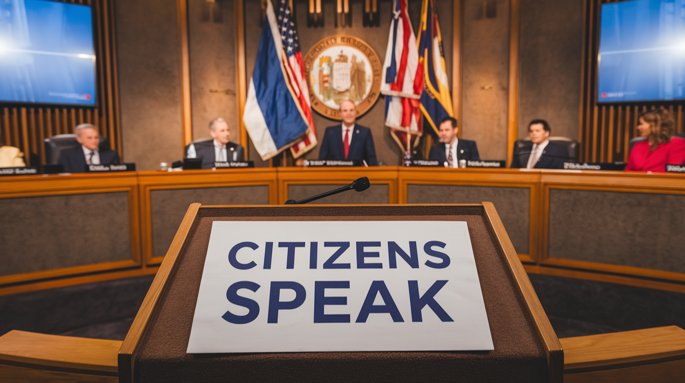

# City Council Meeting Analyzer



[](https://opensource.org/licenses/MIT)
[](https://www.python.org/downloads/)
[](https://openai.com/)
[]()

## 📝 Description

This project is a comprehensive, multi-agent AI system designed to analyze 7 years of Manhattan, Kansas city council meeting transcripts. By leveraging GPT-4 and sophisticated data analysis techniques, this system extracts meaningful insights, patterns, and trends from hundreds of meeting transcripts that would be impractical to analyze manually. I downloaded videos of 7 years of City Council Meetings totalling 900 GB.  I then transcribed and diarized those videos.  The transcriptions are uploaded in the git repository.

The system performs multi-faceted analysis through parallel AI agents focusing on different analytical perspectives:
- Open-ended discovery of meeting themes
- Targeted analysis of key urban governance topics
- Speaker dynamics and power structures
- Emergent patterns and decision-making processes
- Network analysis of topics and speakers
- Temporal trend identification
- Anomalous meeting detection

## 🌟 Features

- **Intelligent Chunking**: Processes large transcripts by splitting them at natural boundaries
- **Multi-perspective Analysis**: Employs different analytical lenses to extract varied insights
- **Speaker Network Analysis**: Maps relationships between speakers across meetings
- **Topic Network Analysis**: Identifies connections between discussion topics
- **Temporal Trend Tracking**: Analyzes how topics and participation evolve over time
- **Anomaly Detection**: Identifies statistically unusual meetings for deeper investigation
- **Comprehensive Visualization**: Generates charts, networks, and word clouds
- **Detailed Reporting**: Creates markdown reports on various aspects of the analysis
- **Resilient Processing**: Includes error handling and recovery mechanisms

## 🖼️ Project Showcase

> **Note**: Full analysis results are pending. The initial run was interrupted at 44% completion due to API quota limitations. The following sections present the approach and expected outputs.

### Expected Visualizations

- Topic co-occurrence networks
- Speaker relationship networks
- Focus area trends over time
- Power dynamics word clouds
- Topic distribution PCA plots
- Speaking equality metrics
- Anomalous meeting statistics

### Expected Reports

- Executive summary
- Focus areas deep dive
- Emergent patterns analysis
- Speaker dynamics insights
- Temporal trends assessment
- Anomalous meetings investigation

## 🛠️ Technologies Used

- **Python 3.9+**: Core programming language
- **OpenAI GPT-4**: For advanced natural language understanding and analysis
- **Pandas & NumPy**: Data processing and numerical operations
- **Matplotlib & Seaborn**: Visualization creation
- **NetworkX**: Network analysis and graph visualization
- **scikit-learn**: For PCA and other ML techniques
- **WordCloud**: For text visualization
- **asyncio & aiohttp**: For efficient asynchronous API calls
- **backoff**: For intelligent API retry logic

## 🔧 Installation & Setup

1. Clone this repository:
```bash
git clone https://github.com/yourusername/city-council-analyzer.git
cd city-council-analyzer
```

2. Create and activate a virtual environment:
```bash
python -m venv venv
source venv/bin/activate  # On Windows: venv\Scripts\activate
```

3. Install dependencies:
```bash
pip install -r requirements.txt
```

4. Create a `.env` file with your OpenAI API key:
```
OPENAI_API_KEY=your_api_key_here
```

5. Prepare your transcript files in a folder structure.

## 📊 Usage

1. Update the folder path in the main function to point to your transcript directory:

```python
folder_path = "/path/to/your/transcripts"  # Update with your folder path
```

2. Run the analysis:

```bash
python meeting_analyzer.py
```

3. Results will be generated in the following directories:
   - `results/`: Individual meeting analysis JSON files
   - `intermediate_results/`: Chunk-by-chunk analysis results
   - `visualizations/`: Charts, network diagrams, and other visuals
   - `reports/`: Markdown reports on different analytical dimensions

## 📂 Project Structure

```
city-council-analyzer/
├── meeting_analyzer.py      # Main application file
├── requirements.txt         # Project dependencies
├── .env                     # Environment variables (API keys)
├── results/                 # Generated analysis results
├── intermediate_results/    # Partial analysis results
├── visualizations/          # Generated charts and graphs
│   ├── wordclouds/          # Topic wordclouds by year
│   ├── topic_network.png    # Topic co-occurrence network
│   └── speaker_network.png  # Speaker relationship network
└── reports/                 # Generated markdown reports
    ├── executive_summary.md         # High-level findings
    ├── focus_areas_report.md        # Detailed topic analysis
    ├── speaker_dynamics_report.md   # Speaker analysis
    ├── emergent_patterns_report.md  # Discovered patterns
    ├── temporal_trends_report.md    # Changes over time
    └── anomalous_meetings_report.md # Unusual meetings
```

## 🚧 Challenges & Solutions

- **Challenge**: Processing 900+ GB of transcript data
  - **Solution**: Implemented efficient chunking strategies and asynchronous processing

- **Challenge**: API rate limits and quota constraints
  - **Solution**: Added backoff retry logic and intermediate result saving for resumable analysis

- **Challenge**: Parsing varied transcript formats
  - **Solution**: Built robust regex-based extractors for speaker segments and metadata

- **Challenge**: Combining chunk-level analyses into cohesive meeting insights
  - **Solution**: Developed intelligent result combination algorithms with deduplication

- **Challenge**: Visualizing complex relationships in the data
  - **Solution**: Created multi-faceted visualization approaches including networks, heatmaps, and word clouds

## 🔮 Future Improvements

- Implement a more cost-efficient API usage strategy
- Add a web-based dashboard for interactive exploration of results
- Incorporate audio-based sentiment analysis from original recordings
- Develop comparative analytics with other city councils
- Create an automated topic classification model fine-tuned on municipal governance
- Implement natural language query interface for exploring the analysis

## 📜 License

This project is licensed under the MIT License - see the LICENSE file for details.

## 👏 Acknowledgments

- Manhattan, Kansas City Council for making their meetings publicly accessible
- OpenAI for providing the GPT-4 API that powers the analysis
- The open-source community for the various libraries used in this project

## 📬 Contact

For questions, suggestions, or collaboration opportunities, please open an issue on this repository.

---

**Note**: This project is currently in progress. Full results are pending completion of the analysis pipeline. Initial run was interrupted at 44% completion due to OpenAI API tier limitations.
